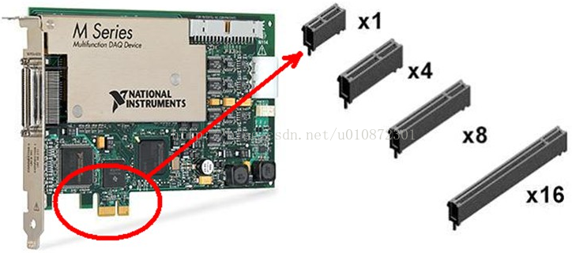
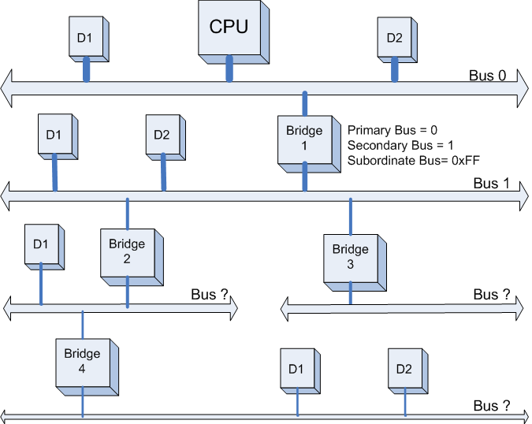
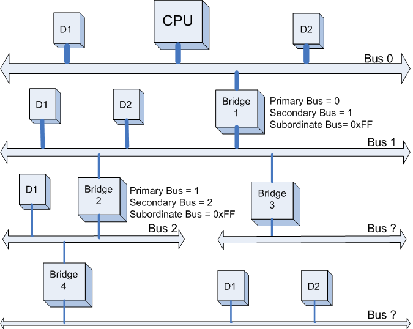
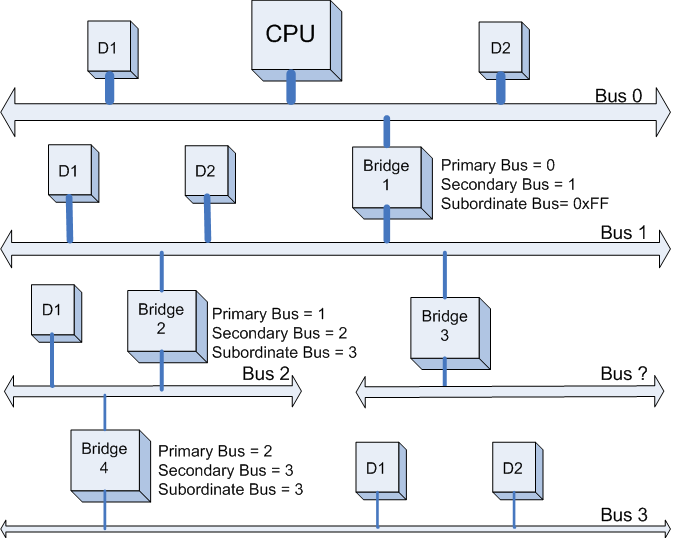
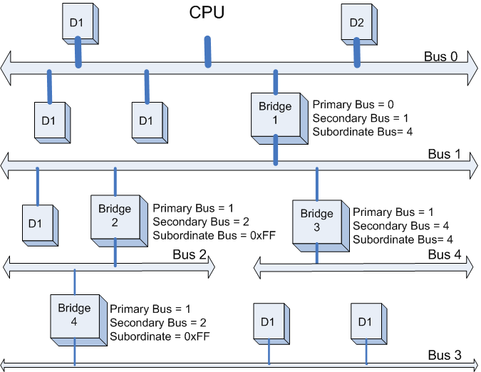

#### 一、即插即用功能只有在同时具备了符合以下4个条件时才可以：
即插即用的标准bios、
即插即用的操作系统、
即插即用的设备、
即插即用的驱动程序

##### PCIE（PCI Express)设备
PCIE插槽是可以向下兼容的，比如PCIE 1X接口可以插4X、8X、16X的插槽上。

linux驱动示例：
```cpp
#include <linux/module.h>
#include <linux/kernel.h>
#include <linux/fs.h>
#include <linux/signal.h>
#include <linux/init.h>
#include <linux/cdev.h>
#include <linux/delay.h>
#include <linux/poll.h>
#include <linux/device.h>
#include <linux/pci.h>
#include <linux/interrupt.h> 
#include <asm/uaccess.h> 
 
MODULE_LICENSE("Dual BSD/GPL");
MODULE_DESCRIPTION("pcie device driver");
 
#define DEV_NAME "hello_pcie"
#define DEBUG 
 
#ifdef DEBUG
	#define DEBUG_ERR(format,args...) \
	do{  \
		printk("[%s:%d] ",__FUNCTION__,__LINE__); \
		printk(format,##args); \
	}while(0)
#else
	#define DEBUG_PRINT(format,args...) 
#endif
 
//1M 
#define DMA_BUFFER_SIZE 1*1024*1024 
#define FASYNC_MINOR 1
#define FASYNC_MAJOR 244
#define DEVICE_NUMBER 1
 
static struct class * hello_class;
static struct device * hello_class_dev;
 
struct hello_device
{
	struct pci_dev* pci_dev;
	struct cdev cdev;
	dev_t devno;
}my_device;
 
//barn(n=0,1,2或者0，1，2，3，4，5) 空间的物理地址，长度，虚拟地址
unsigned long bar0_phy;
unsigned long bar0_vir;
unsigned long bar0_length;
unsigned long bar1_phy;
unsigned long bar1_vir;
unsigned long bar1_length;
 
//进行DMA转换时，dma的源地址和目的地址
dma_addr_t dma_src_phy;
dma_addr_t dma_src_vir;
dma_addr_t dma_dst_phy;
dma_addr_t dma_dst_vir;
 
//根据设备的id填写,这里假设厂商id和设备id
#define HELLO_VENDOR_ID 0x666
#define HELLO_DEVICE_ID 0x999
static struct pci_device_id hello_ids[] = {
    {HELLO_VENDOR_ID,HELLO_DEVICE_ID,PCI_ANY_ID,PCI_ANY_ID,0,0,0},
    {0,}
};
MODULE_DEVICE_TABLE(pci,hello_ids);
 
static int hello_probe(struct pci_dev *pdev, const struct pci_device_id *id);
static void hello_remove(struct pci_dev *pdev);
static irqreturn_t hello_interrupt(int irq, void * dev);
 
//往iATU写数据的函数
void iATU_write_config_dword(struct pci_dev *pdev,int offset,int value)
{
	
}
 
//假设需要将bar0映射到内存
static void iATU_bar0(void)
{
	//下面几步，在手册中有example
	//iATU_write_config_dword(my_device.pci_dev,iATU Lower Target Address ,xxx);//xxx表示内存中的地址，将bar0映射到这块内存
	//iATU_write_config_dword(my_device.pci_dev,iATU Upper Target Address ,xxx);//xxx表示内存中的地址，将bar0映射到这块内存
 
	//iATU_write_config_dword(my_device.pci_dev,iATU Control 1,0x0);//映射的时内存，所以写0x0
	//iATU_write_config_dword(my_device.pci_dev,iATU Control 2,xxx);//使能某个region，开始地址转换
}
 
 
//往dma配置寄存器中读写数据的函数，这是难点一：dma寄存器的寻址。
int dma_read_config_dword(struct pci_dev *pdev,int offset)
{
	int value =0;
	return value;
}
 
void dma_write_config_dword(struct pci_dev *pdev,int offset,int value)
{
	
}
 
void dma_init(void)
{
	int pos;
	u16 msi_control;
	u32 msi_addr_l;
	u32 msi_addr_h;
	u32 msi_data;
	
	//1.dma 通道0 写初始化 。如何访问DMA global register 寄存器组需要根据具体的硬件，可以通过pci_write/read_config_word/dword，
	//也可以通过某个bar，比如通过bar0+偏移量访问。
	//1.1 DMA write engine enable =0x1，这里请根据自己的芯片填写
	//dma_write_config_dword(->pci_dev,DMA write engine enable,0x1);	
	//1.2 获取msi能力寄存器的地址
	pos =pci_find_capability(my_device.pci_dev,PCI_CAP_ID_MSI);
	//1.3 读取msi的协议部分，得到pci设备是32位还是64位，不同的架构msi data寄存器地址同
	pci_read_config_word(my_device.pci_dev,pos+2,&msi_control);
	//1.4 读取msi能力寄存器组中的地址寄存器的值
	pci_read_config_dword(my_device.pci_dev,pos+4,&msi_addr_l);	
	//1.5 设置 DMA write done IMWr Address Low.这里请根据自己的芯片填写
	//dma_write_config_dword(my_device.pci_dev,DMA write done IMWr Address Low,msi_addr_l);
	//1.6 设置 DMA write abort IMWr Address Low.这里请根据自己的芯片填写
	//dma_write_config_dword(my_device.pci_dev,DMA write abort IMWr Address Low,msi_addr_l);
	
	if(msi_control&0x80){
		//64位的
		//1.7 读取msi能力寄存器组中的高32位地址寄存器的值
		pci_read_config_dword(my_device.pci_dev,pos+0x8,&msi_addr_h);
		//1.8 读取msi能力寄存器组中的数据寄存器的值
		pci_read_config_dword(my_device.pci_dev,pos+0xc,&msi_data);
		
		//1.9 设置 DMA write done IMWr Address High.这里请根据自己的芯片填写
		//dma_write_config_dword(my_device.pci_dev,DMA write done IMWr Address High,msi_addr_h);
		//1.10 设置 DMA write abort IMWr Address High.这里请根据自己的芯片填写
		//dma_write_config_dword(my_device.pci_dev,DMA write abort IMWr Address High,msi_addr_h);
		
	} else {
		//1.11 读取msi能力寄存器组中的数据寄存器的值
		pci_read_config_dword(my_device.pci_dev,pos+0x8,&msi_data);
	}
	
	//1.12 把数据寄存器的值写入到dma的控制寄存器组中的 DMA write channel 0 IMWr data中
	//dma_write_config_dword(my_device.pci_dev,DMA write channel 0 IMWr data,msi_data);
	
	//1.13 DMA channel 0 control register 1 = 0x4000010
	//dma_write_config_dword(my_device.pci_dev,DMA channel 0 control register 1,0x4000010);
	
	//2.dma 通道0 读初始化 和上述操作类似，不再叙述。
}
 
static int hello_probe(struct pci_dev *pdev, const struct pci_device_id *id)
{
	int i;
	int result;
	//使能pci设备
	if (pci_enable_device(pdev)){
        result = -EIO;
		goto end;
	}
	
	pci_set_master(pdev);	
	my_device.pci_dev=pdev;
 
	if(unlikely(pci_request_regions(pdev,DEV_NAME))){
		DEBUG_ERR("failed:pci_request_regions\n");
		result = -EIO;
		goto enable_device_err;
	}
	
	//获得bar0的物理地址和虚拟地址
	bar0_phy = pci_resource_start(pdev,0);
	if(bar0_phy<0){
		DEBUG_ERR("failed:pci_resource_start\n");
		result =-EIO;
		goto request_regions_err;
	}
	
	//假设bar0是作为内存，流程是这样的，但是在本程序中不对bar0进行任何操作。
	bar0_length = pci_resource_len(pdev,0);
	if(bar0_length!=0){
		bar0_vir = (unsigned long)ioremap(bar0_phy,bar0_length);
	}
	
	//申请一块DMA内存，作为源地址，在进行DMA读写的时候会用到。
	dma_src_vir=(dma_addr_t)pci_alloc_consistent(pdev,DMA_BUFFER_SIZE,&dma_src_phy);
	if(dma_src_vir != 0){
		for(i=0;i<DMA_BUFFER_SIZE/PAGE_SIZE;i++){
			SetPageReserved(virt_to_page(dma_src_phy+i*PAGE_SIZE));
		}
	} else {
		goto free_bar0;
	}
	
	//申请一块DMA内存，作为目的地址，在进行DMA读写的时候会用到。
	dma_dst_vir=(dma_addr_t)pci_alloc_consistent(pdev,DMA_BUFFER_SIZE,&dma_dst_phy);
	if(dma_dst_vir!=0){
		for(i=0;i<DMA_BUFFER_SIZE/PAGE_SIZE;i++){
			SetPageReserved(virt_to_page(dma_dst_phy+i*PAGE_SIZE));
		}
	} else {
		goto alloc_dma_src_err;
	}
	//使能msi，然后才能得到pdev->irq
	 result = pci_enable_msi(pdev);
	 if (unlikely(result)){
		DEBUG_ERR("failed:pci_enable_msi\n");
		goto alloc_dma_dst_err;
    }
	
	result = request_irq(pdev->irq, hello_interrupt, 0, DEV_NAME, my_device.pci_dev);
    if (unlikely(result)){
       DEBUG_ERR("failed:request_irq\n");
	   goto enable_msi_error;
    }
	
	//DMA 的读写初始化
	dma_init();
	
enable_msi_error:
		pci_disable_msi(pdev);
alloc_dma_dst_err:
	for(i=0;i<DMA_BUFFER_SIZE/PAGE_SIZE;i++){
		ClearPageReserved(virt_to_page(dma_dst_phy+i*PAGE_SIZE));
	}
	pci_free_consistent(pdev,DMA_BUFFER_SIZE,(void *)dma_dst_vir,dma_dst_phy);
alloc_dma_src_err:
	for(i=0;i<DMA_BUFFER_SIZE/PAGE_SIZE;i++){
		ClearPageReserved(virt_to_page(dma_src_phy+i*PAGE_SIZE));
	}
	pci_free_consistent(pdev,DMA_BUFFER_SIZE,(void *)dma_src_vir,dma_src_phy);
free_bar0:
	iounmap((void *)bar0_vir);
request_regions_err:
	pci_release_regions(pdev);
	
enable_device_err:
	pci_disable_device(pdev);
end:
	return result;
}
 
static void hello_remove(struct pci_dev *pdev)
{
	int i;
	
	free_irq(pdev->irq,my_device.pci_dev);
	pci_disable_msi(pdev);
 
	for(i=0;i<DMA_BUFFER_SIZE/PAGE_SIZE;i++){
		ClearPageReserved(virt_to_page(dma_dst_phy+i*PAGE_SIZE));
	}
	pci_free_consistent(pdev,DMA_BUFFER_SIZE,(void *)dma_dst_vir,dma_dst_phy);
 
	for(i=0;i<DMA_BUFFER_SIZE/PAGE_SIZE;i++){
		ClearPageReserved(virt_to_page(dma_src_phy+i*PAGE_SIZE));
	}
	pci_free_consistent(pdev,DMA_BUFFER_SIZE,(void *)dma_src_vir,dma_src_phy);
 
	iounmap((void *)bar0_vir);
	pci_release_regions(pdev);
	pci_disable_device(pdev);
}
 
//难点三：中断响应设置
static irqreturn_t hello_interrupt(int irq, void * dev)
{  
    //1.该中断调用时机：当DMA完成的时候，会往msi_addr中写入msi_data,从而产生中断调用这个函数
	//2.根据DMA Channel control 1 register寄存器的状态，判断读写状态，读失败，写失败，读成功，写成功，做出不同的处理。
	return 0;
}
static struct pci_driver hello_driver = {
    .name = DEV_NAME,
    .id_table = hello_ids,
    .probe = hello_probe,
    .remove = hello_remove,
};
 
static int hello_open(struct inode *inode, struct file *file)
{
	printk("driver: hello_open\n");
	//填写产品的逻辑
	return 0;
}
 
int hello_close(struct inode *inode, struct file *file)
{
	printk("driver: hello_close\n");
	//填写产品的逻辑
	return 0;
}
 
long hello_unlocked_ioctl(struct file *file, unsigned int cmd, unsigned long arg)
{
	//填写产品的逻辑
	//为应用层提供的函数接口，通过解析cmd，在switch中做出不同的处理。 
	iATU_bar0();//某个合适的地方调用
	return 0;
	
}
 
//难点二：启动dma的读写（read和write函数).
static struct file_operations hello_fops = {
	.owner   		=  THIS_MODULE,    
	.open   		=  hello_open,     
	.release 		=  hello_close,
	.unlocked_ioctl =  hello_unlocked_ioctl,
};
 
static int hello_drv_init(void)
{
	int ret;
	ret = pci_register_driver(&hello_driver);
	if (ret < 0) {
		printk("failed: pci_register_driver\n");
		return ret;
	}
	
	ret=alloc_chrdev_region(&my_device.devno,0,DEVICE_NUMBER,"hello");
	if (ret < 0) {
		printk("failed: register_chrdev_region\n");
		return ret;
	}
 
	cdev_init(&my_device.cdev, &hello_fops);
	ret = cdev_add(&my_device.cdev, my_device.devno, DEVICE_NUMBER);
	if (ret < 0) {
		printk("faield: cdev_add\n");
		return ret;
	}
	
	hello_class = class_create(THIS_MODULE, "hello_class");
	hello_class_dev = device_create(hello_class, NULL, my_device.devno, NULL, "hello_device"); 
 
	return 0;
}
 
static void hello_drv_exit(void)
{
	device_destroy(hello_class,my_device.devno);
	class_destroy(hello_class);
		
	cdev_del(&(my_device.cdev));
	unregister_chrdev_region(my_device.devno,DEVICE_NUMBER);
	pci_unregister_driver(&hello_driver);
}
 
module_init(hello_drv_init);
module_exit(hello_drv_exit);
```

#### 二、ISA总线通常称为第一代I/O总线，而PCI是第二代I/O总线标准，PCI-Express总线可称之为计算机的第三代I/O总线
PCI总线是计算机的I/O总线，在90年代时替代了ISA总线，成为计算机中的局部总线一直使用至今。
PCI总线在发展的过程中，不断自我革新，满足时代的需求。在短短10多年间，PCI总线历经了PCI、PCI-X以及PCI-E的演变历程。

传统PCI总线具有32位数据宽度，33MHz的时钟频率，能够支持设备的即插即用、自动识别与配置。与ISA总线相比，不仅在性能上提升了一大截，而且在资源管理上也有质的变化。更为重要的是，ISA总线本质上是处理器总线的延伸，而PCI总线是与处理器总线无关的总线标准，不受制于处理器的类别，数据的传输需要通过桥设备进行转发。因此，ISA总线通常称为第一代I/O总线，而PCI是第二代I/O总线标准，这是一种技术发展的跨越。

随着时代的发展，传统PCI总线的性能得到了挑战，越来越不能满足外设的需求。最为典型的是图像传输受到了PCI性能瓶颈的影响，因此，几年前的显卡设备都脱离PCI总线，单立门户形成了一个新的总线标准AGP，这显然是对PCI总线性能的一种否定。

技术在不断发展，对高速传输需求的IO设备越来越多，Gbps网络、光纤通道都对传统PCI的性能提出了质疑，传统PCI总线已经不能满足此类应用的需求了。
所以，在1999年提出了PCI-X协议规范，该总线具有64位总线宽度，最高能够达到133MHz的时钟频率，在性能上较PCI总线有了一个大的跨越。
但是，PCI-X总线仍然是一种并行总线，其存在并行传输过程中的数据相位问题，因此，当PCI-X频率达到一定程度之后，总线带载能力就变的相当差。在133MHz总线频率时，PCI-X总线只能带一个PCI设备。
PCI总线的发展遇到了并行总线的技术瓶颈，因此，PCI总线需要做总线结构的根本性变革。

历史的车轮进入21世纪之后提出了PCI-Express总线，其将并行总线演变成了点对点的串行总线，在性能可扩展性方面跨入了一个新的台阶。
所以，PCI-Express总线也可以称之为计算机的第三代I/O总线。

#### 三、PCIe及USB传输速度
```cpp
PCIe各标准的速度如下
| 版本|	发布时间|	原始数据传输带宽|	有效带宽|	单个Lane带宽	总带宽(x16)|
|--|--|--|--|--|--|
|PCIe1.x|	2003|	2.5GT/s|	2Gbps|	250MB/s|	8GB/s|
|PCIe2.x|	2007|	5.0GT/s|	4Gbps|	500MB/s|	16GB/s|
|PCIe3.0|	2010|	8.0GT/s|	8Gbps|	1GB/s|	32GB/s|
```
对比之后，发现个奇怪问题，按照常理新一代的带宽要比上一代翻倍，PCIe3.0的原始数据传输带宽应该是10GT/s才对而实际却只有8.0GT/s。我们知道，在1.0，2.0标准中，采用的是8b/10b的编码方式，也就是说，每传输8比特有效数据，要附带两比特的校验位，实际要传输10比特数据。因此，有效带宽=原始数据传输带宽*80%。

而3.0标准中，使用了更为有效的128b/130b编码方案从而避免20%带宽损失，3.0的浪费带宽仅为1.538%，基本可以忽略不计，因此8GT/s的信号不再仅仅是一个理论数值，它将是一个实在的传输值。
```cpp
USB各标准的速度如下：
|版本|	发布时间|	数据带宽|	数据带宽|
|--|--|--|--|--|--|
|USB 1.0|	1996|	1.5Mbps|	192KB/s|
|USB 1.1|	1998|	18Mbps|	1.5MB/s|
|USB 2.0|	2000|	480Mbps|	60MB/s|
|USB 3.0|	2008|	5Gbps|	640MB/s|
```
值得注意的是，USB3.0也采用了8b/10b的编码方式，因此实际传输带宽也要打个8折：640MB/s*80% = 512MB/s


#### 四、BIOS枚举PCI设备
从我们按下PC的电源按钮开始，BIOS就接管系统控制权开始工作，它会先进行一些内存和设备的初始化工作（当然，也包括我们的PCI设备）。  
PCI设备的扫描是基于深度优先搜索算法（DFS：Depth First Search)，也就是说，下级分支最多的PCI桥将最先完成其子设备的扫描。下面我们以图片来具体说明，ＢＩＯＳ是如何一步步完成PCI 设备扫描的。
* 第一步：
PCI Host 主桥扫描Bus 0上的设备（在一个处理器系统中，一般将与HOST主桥直接相连的PCI总线被命名为PCI Bus 0），系统首先会忽略Bus 0上的D1，D2等不会挂接PCI桥的设备，主桥发现Bridge 1后，将Bridge1 下面的PCI Bus定为 Bus 1，系统将初始化Bridge 1的配置空间，并将该桥的Primary Bus Number 和 Secondary Bus Number寄存器分别设置成0和1，以表明Bridge1 的上游总线是0，下游总线是1，由于还无法确定Bridge1下挂载设备的具体情况，系统先暂时将Subordinate Bus Number设为0xFF。如下图所示：

* 第二步：
系统开始扫描Bus 1，将会发现Bridge 2。系统将Bridge 2下面的PCI Bus定为Bus 2，并将该桥的Primary Bus Number 和 Secondary Bus Number寄存器分别设置成1和2，和上一步一样暂时把Bridge 2 的Subordinate Bus Number设为0xFF。如下图所示：


* 第三步：
系统继续扫描Bus 2，将会发现Bridge 4。系统将Bridge 4下面的PCI Bus定为Bus 3，并将该桥的Primary Bus Number 和 Secondary Bus Number寄存器分别设置成2和3，此后 系统继续扫描后发现Bus 3 下面已经没有任何Bridge了，意味着该PCI总线下已经没有任何挂载下游总线了，因此Bridge 4的Subordinate Bus Number的值已经可以确定为3了。


* 第四步：
完成Bus 3的扫描后，系统返回到Bus 2继续扫描，发现Bus 2下面已经没有其他Bridge了。此时Bridge 2的Subordinate Bus Number的值也已经可以确定为3了。如下图所示：


* 第五步：
完成Bus 2的扫描后，系统返回到Bus1继续扫描，会发现Bridge 3，系统将Bridge 3下面的PCI Bus定为Bus 4。并将Bridge 4的Primary Bus Number 和 Secondary Bus Number寄存器分别设置成1和4，此后系统继续扫描后发现Bus 4 下面已经没有任何Bridge了，意味着该PCI总线下已经没有挂载任何下游总线了，因此Bridge 3 的Subordinate Bus Number的值已经可以确定为4了。如下图所示：


* 第六步：
完成Bus 4的扫描后，系统返回到Bus 1继续扫描， 发现Bus 1下面已经没有其他Bridge了。此时Bridge 1的Subordinate Bus Number的值已经可以确定为4，系统返回Bus 0继续扫描（Bus 0下如果有其他它Bridge，将重复上述的步骤进行扫描）。至此，本例中的整个PCI的设备扫描已经完成了。最终的设备和总线的扫描结果如下图所示。



一般来说，我们可以通过两个寄存器来访问PCI的配置空间（寄存器CONFIG_ADDRESS与CONFIG_DATA），在x86体系下，这两个寄存器分别对应0xCF8和0xCFC端口，对配置空间的访问都是通过对这两个寄存器的读写来实现先。CONFIG_ADDRESS寄存器的具体位组成如下图所示：

Bus Number : 总线号（8 bit)，范围0--255。
Device Number: 设备号（5 bit)，范围0--31。
Function Number: 功能号（3 bit)，范围0--7。
Register Number: 寄存器号（6 bit),范围0--63 （配置空间一共256个字节，分割成64个4字节的寄存器，从0--63编号）。

每个PCI设备可根据上图所示的四个信息：Bus Number, Device Number, Function Number，Register Number 来进行具体设备的定位并对其配置空间访问。当我们要访问PCI设备的配置空间时，先根据以上格式设置CONFIG_ADDRESS寄存器，然后再读取CONFIG_DATA寄存器即可得到相应的配置空间寄存器的值。
```cpp
//总体来说。该BIOS扫描过程中调用如下几个主要的函数：
//ob_pci_init  ----> ob_scan_pci_bus ----> pci_find_device ----> ob_pci_configure
//初始化
int ob_pci_init(void)
{
    int bus;
    unsigned long mem_base, io_base;
	char *path;
 
#ifdef CONFIG_DEBUG_PCI
	printk("Initializing PCI devices...\n");
#endif
 
	/* brute force bus scan */
 
	/* Find all PCI bridges */
 
    //获取系统指定的memeory与I/O空间的范围，分配给PCIe设备。
	mem_base = arch->mem_base;
    /* I/O ports under 0x400 are used by devices mapped at fixedlocation. */
    io_base = arch->io_base + 0x400;
	path = strdup("");
 
    /*遍历256条总线*/
    for (bus = 0; bus<0x100; bus++) {
		ob_scan_pci_bus(bus, &mem_base, &io_base, &path);
	}
	free(path);
	return 0;
}

//总线扫描具体实现：
static void ob_scan_pci_bus(int bus, unsigned long *mem_base,
                            unsigned long *io_base, char **path)
{
	int devnum, fn, is_multi, vid, did;
	unsigned int htype;
	pci_addr addr;
	pci_config_t config;
    const pci_dev_t *pci_dev;
	uint32_t ccode;
	uint8_t class, subclass, iface, rev;
 
	activate_device("/");
	for (devnum = 0; devnum < 32; devnum++) {
		is_multi = 0;
		for (fn = 0; fn==0 || (is_multi && fn<8); fn++) {
#ifdef CONFIG_XBOX
			if (pci_xbox_blacklisted (bus, devnum, fn))
				continue;
#endif
			addr = PCI_ADDR(bus, devnum, fn);       /*获取设备配置空间地址*/
			vid = pci_config_read16(addr, PCI_VENDOR_ID);  /*获取Vendor ID*/
			did = pci_config_read16(addr, PCI_DEVICE_ID);  /*获取Device ID*/
 
			if (vid==0xffff || vid==0)
				continue;
 
			ccode = pci_config_read16(addr, PCI_CLASS_DEVICE);
			class = ccode >> 8;
			subclass = ccode;
			iface = pci_config_read8(addr, PCI_CLASS_PROG);
			rev = pci_config_read8(addr, PCI_REVISION_ID);
 
			pci_dev = pci_find_device(class, subclass, iface,/*具体设备查找以及初始化*/vid, did);
 
#ifdef CONFIG_DEBUG_PCI
			printk("%x:%x.%x - %x:%x - ", bus, devnum, fn,vid, did);
#endif
			htype = pci_config_read8(addr, PCI_HEADER_TYPE);
			if (fn == 0)
				is_multi = htype & 0x80;
 
			if (pci_dev == NULL || pci_dev->name == NULL)
                snprintf(config.path, sizeof(config.path),"%s/pci%x,%x", *path, vid, did);
			else
                snprintf(config.path, sizeof(config.path),"%s/%s", *path, pci_dev->name);
#ifdef CONFIG_DEBUG_PCI
			printk("%s - ", config.path);
#endif
			config.dev = addr & 0x00FFFFFF;
			REGISTER_NAMED_NODE(ob_pci_node, config.path);
			activate_device(config.path);
            ob_pci_configure(addr, &config, mem_base, io_base); /*配置设备的配置空间*/
			ob_pci_add_properties(addr, pci_dev, &config);
 
            if (class == PCI_BASE_CLASS_BRIDGE &&
               (subclass == PCI_SUBCLASS_BRIDGE_HOST ||
                subclass == PCI_SUBCLASS_BRIDGE_PCI)) {
				/* host or bridge */
				free(*path);
				*path = strdup(config.path);
			}
		}
	}
	device_end();
}
//具体某条总线上的设备扫描由以下函数实现：
const pci_dev_t *pci_find_device (uint8_t class, uint8_t subclass,
                                  uint8_t iface, uint16_t vendor,
                                  uint16_t product)
{
    int (*config_cb)(const pci_config_t *config);
    const pci_class_t *pclass;
    const pci_subclass_t *psubclass;
    const pci_iface_t *piface;
    const pci_dev_t *dev;
    const void *private;
    pci_dev_t *new;
    const char *name, *type;
 
    name = "unknown";
    type = "unknown";
    config_cb = NULL;
    private = NULL;
 
    if (class == 0x00 && subclass == 0x01) {
        /* Special hack for old style VGA devices */
        class = 0x03;
        subclass = 0x00;
    } else if (class == 0xFF) {
        /* Special case for misc devices */
        dev = misc_pci;
        goto find_device;
    }
    if (class > (sizeof(pci_classes) / sizeof(pci_class_t))) {
        name = "invalid PCI device";
        type = "invalid";
        goto bad_device;
    }
    pclass = &pci_classes[class];
    name = pclass->name;
    type = pclass->type;
    for (psubclass = pclass->subc; ; psubclass++) {
        if (psubclass->subclass == 0xFF)
            goto bad_device;
        if (psubclass->subclass == subclass) {
            if (psubclass->name != NULL)
                name = psubclass->name;
            if (psubclass->type != NULL)
                type = psubclass->type;
            if (psubclass->config_cb != NULL) {
                config_cb = psubclass->config_cb;
            }
            if (psubclass->private != NULL)
                private = psubclass->private;
            if (psubclass->iface != NULL)
                break;
            dev = psubclass->devices;
            goto find_device;
        }
    }
    for (piface = psubclass->iface; ; piface++) {
        if (piface->iface == 0xFF) {
            dev = psubclass->devices;
            break;
        }
        if (piface->iface == iface) {
            if (piface->name != NULL)
                name = piface->name;
            if (piface->type != NULL)
                type = piface->type;
            if (piface->config_cb != NULL) {
                config_cb = piface->config_cb;
            }
            if (piface->private != NULL)
                private = piface->private;
            dev = piface->devices;
            break;
        }
    }
find_device:
    if (dev == NULL)
	goto bad_device;
    for (;; dev++) {
        if (dev->vendor == 0xFFFF && dev->product == 0xFFFF) {
            goto bad_device;
        }
        if (dev->vendor == vendor && dev->product == product) {
            if (dev->name != NULL)
                name = dev->name;
            if (dev->type != NULL)
                type = dev->type;
            if (dev->config_cb != NULL) {
                config_cb = dev->config_cb;
            }
            if (dev->private != NULL)
                private = dev->private;
            new = malloc(sizeof(pci_dev_t));
            if (new == NULL)
                return NULL;
            new->vendor = vendor;
            new->product = product;
            new->type = type;
            new->name = name;
            new->model = dev->model;
            new->compat = dev->compat;
            new->acells = dev->acells;
            new->scells = dev->scells;
            new->icells = dev->icells;
            new->config_cb = config_cb;
            new->private = private;
 
            return new;
        }
    }
bad_device:
    printk("Cannot manage '%s' PCI device type '%s':\n %x %x (%x %x %x)\n",
           name, type, vendor, product, class, subclass, iface);
 
    return NULL;
}
//配置具体设备的配置空间
static inline uint32_t pci_config_read32(pci_addr dev, uint8_t reg)
{
    outl(dev | reg, 0xcf8);
    return inl(0xcfc | reg);
}
static inline void pci_config_write32(pci_addr dev, uint8_t reg, uint32_t val)
{
    outl(dev | reg, 0xcf8);
    outl(val, 0xcfc);
}
static void ob_pci_configure(pci_addr addr, pci_config_t *config, unsigned long *mem_base,
                 unsigned long *io_base)
 
{
	uint32_t smask, omask, amask, size, reloc, min_align;
        unsigned long base;
	pci_addr config_addr;
	int reg;
	uint8_t irq_pin, irq_line;
        
        /*配置中断引脚与中断编号*/
	irq_pin =  pci_config_read8(addr, PCI_INTERRUPT_PIN);
	if (irq_pin) {
		config->irq_pin = irq_pin;
		irq_pin = (((config->dev >> 11) & 0x1F) + irq_pin - 1) & 3;
		irq_line = arch->irqs[irq_pin];
		pci_config_write8(addr, PCI_INTERRUPT_LINE, irq_line);
		config->irq_line = irq_line;
	} else
		config->irq_line = -1;
 
        /*配置memory空间和I/O空间*/
	omask = 0x00000000;
	for (reg = 0; reg < 7; reg++) {
 
		config->assigned[reg] = 0x00000000;
		config->sizes[reg] = 0x00000000;
 
		if ((omask & 0x0000000f) == 0x4) {
			/* 64 bits memory mapping */
			continue;
		}
 
		if (reg == 6)
			config_addr = PCI_ROM_ADDRESS;
		else
			config_addr = PCI_BASE_ADDR_0 + reg * 4;
 
		config->regions[reg] = pci_config_read32(addr, config_addr);
 
		/* get region size */
 
		pci_config_write32(addr, config_addr, 0xffffffff);
		smask = pci_config_read32(addr, config_addr);
		if (smask == 0x00000000 || smask == 0xffffffff)
			continue;
 
		if (smask & 0x00000001 && reg != 6) {
			/* I/O space */
			base = *io_base;
			min_align = 1 << 7;
			amask = 0x00000001;
			pci_config_write16(addr, PCI_COMMAND,
					   pci_config_read16(addr,PCI_COMMAND) | PCI_COMMAND_IO);
		} else {
			/* Memory Space */
			base = *mem_base;
			min_align = 1 << 16;
			amask = 0x0000000F;
			if (reg == 6) {
				smask |= 1; /* ROM */
			}
			pci_config_write16(addr, PCI_COMMAND,
					   pci_config_read16(addr,PCI_COMMAND) | PCI_COMMAND_MEMORY);
		}
		omask = smask & amask;
		smask &= ~amask;
		size = (~smask) + 1;
		config->sizes[reg] = size;
		reloc = base;
		if (size < min_align)
			size = min_align;
		reloc = (reloc + size -1) & ~(size - 1);
		if (*io_base == base) {
			*io_base = reloc + size;
			reloc -= arch->io_base;
		} else {
			*mem_base = reloc + size;
		}
		pci_config_write32(addr, config_addr, reloc | omask);
		config->assigned[reg] = reloc | omask;
	}
}
 
通过以上这些步骤，Bios就完成了所有PCI设备的扫描，并且为每个设备分配好了系统资源。
```

#### 五、OS枚举PCI设备
Bios中各种准备工作做好后，就开始引导装载操作系统，系统的控制权移交给操作系统，操作系统中也要对系统中各PCI设备进行扫描以及初始化（和上文中提到的Bios对PCI设备的枚举和配置一样），事实上，早期的操作系统也是通过Bios调用的方式来获取系统PCI设备信息的，只不过现在变成亲自动手了。总体来说，操作系统对PCI的枚举以及初始化的过程和Bios的基本一致。

#### 六、windows下PCIe设备在驱动流程
```cpp
驱动程序的入口点

NTSTATUS DriverEntry(PDRIVER_OBJECT DriverObj, PUNICODE_STRING RegistryPath)
{
	DebugPrint("DriverEntry() Start\n");
	
	/* 注册派遣函数 */
	DriverObj->DriverUnload				= DemoPciUnload;
	DriverObj->DriverExtension->AddDevice		= DemoPciAddDevice;
	DriverObj->DriverStartIo			= DemoPciStartIo;
	DriverObj->MajorFunction[IRP_MJ_PNP]		= DemoPciPnp;
	DriverObj->MajorFunction[IRP_MJ_POWER]		= DemoPciPower;
	DriverObj->MajorFunction[IRP_MJ_SYSTEM_CONTROL]	= DemoPciSystemControl;
	DriverObj->MajorFunction[IRP_MJ_CREATE]		= DemoPciCreateClose;
	DriverObj->MajorFunction[IRP_MJ_CLOSE]		= DemoPciCreateClose;
	DriverObj->MajorFunction[IRP_MJ_DEVICE_CONTROL]	= DemoPciDeviceControl;
 
	DebugPrint("DriverEntry() End\n");
	
	return STATUS_SUCCESS;
}
//当PnP管理器检测到我们的PCIe设备时，它首先通过查阅相关的注册表来了解哪些驱动程序将管理我们的这个设备，并将驱动加载进来，然后调用驱动中的已经注册好的AddDevice函数（上述代码中注册的DemoPciAddDevice函数）。该函数将为我们的PCIe设备创建设备对象，并将该设备对象挂载在相应的设备栈上。


NTSTATUS DemoPciAddDevice(
	IN PDRIVER_OBJECT DriverObject,
	IN PDEVICE_OBJECT PhysicalDeviceObject
)
{
	UCHAR			i;
	UNICODE_STRING		devname;
	ULONG			xsize;
	NTSTATUS		status = STATUS_SUCCESS;
	PTSTDPCI_DEVICE_EXT	pDevExt = NULL;
	PDEVICE_OBJECT		functionalDeviceObject = NULL;
	
	DebugPrint("DemoPciAddDevice() Start\n");
	
	if( (DriverObject == NULL) || (PhysicalDeviceObject == NULL) )
		return (STATUS_NO_SUCH_DEVICE);
	
        /*设备名*/
    RtlInitUnicodeString(&devname,TSTDPCI_DEVICE_NAME);
 
        /*我们定义的扩展设备对象的大小*/
        xsize=( (sizeof(DEMOPCI_DEVICE_EXT) + 7) & (~7) );
 
        /*创建设备对象*/
	status = IoCreateDevice( DriverObject,
				 xsize,
				 &devname,
				 FILE_DEVICE_DEMOPCI,
				 0,				//FILE_DEVICE_SECURE_OPEN,
				 FALSE,
				 &functionalDeviceObject
			        );
	if( !NT_SUCCESS(status) )
	{
		return (status);
	}
	if(functionalDeviceObject == NULL)
	{
		return (STATUS_UNSUCCESSFUL);
	}
	
    __try
    {
        /* 获取扩展设备对象 */
        pDevExt = (PDEMOPCI_DEVICE_EXT)(functionalDeviceObject->DeviceExtension);
    
        if(pDevExt != NULL)
        {
            /* 扩展设备对象初始化 */
            pDevExt->FunctionalDeviceObject	= functionalDeviceObject;
            pDevExt->PhysicalDeviceObject	= PhysicalDeviceObject;
            pDevExt->OutstandingIO		= 0;
            pDevExt->Started  				= FALSE;
            pDevExt->Removed  			= FALSE;
            pDevExt->Removing 			= FALSE;
            pDevExt->State 				= STATE_NEVER_STARTED;
    
                    /*内核事件初始化*/		
            KeInitializeEvent(&pDevExt->RemoveEvent, NotificationEvent, FALSE);
    
            for(i=0; i<PCI_TYPE0_ADDRESSES; i++)
            {
                pDevExt->base[i].WhichMapped = TYPE_NONE;
            }
    
            RtlZeroMemory(&(pDevExt->CmnBuffSysPhyAddr), sizeof(pDevExt->CmnBuffSysPhyAddr));
            pDevExt->CmnBuffSize			= 0;
            pDevExt->CmnBuffSysVirAddr	= NULL;
            pDevExt->CmnBuffMdl			= NULL;
            pDevExt->CmnBuffUserAddr		= NULL;
            
            pDevExt->pDmaIrp 			= NULL;
    
                    /*注册接口*/
            status = IoRegisterDeviceInterface(PhysicalDeviceObject, (LPGUID)&DEMOPCI_GUID, NULL, &pDevExt->ifname);
        }
        else
        {
            status=STATUS_UNSUCCESSFUL;
        }
    
        if ( !NT_SUCCESS(status) )
        {
            /* 删除FDO */
            if(pDevExt->FunctionalDeviceObject != NULL)
                IoDeleteDevice(pDevExt->FunctionalDeviceObject);
            __leave;
        }
    
        // Ask the I/O Manager to use describe user read/write buffers using MDLs
        functionalDeviceObject->Flags |= DO_DIRECT_IO;
    
            /*将该设备对象挂载在设备栈上*/
        pDevExt->LowerDeviceObject = IoAttachDeviceToDeviceStack(
                                    functionalDeviceObject,
                                    PhysicalDeviceObject);
        if(pDevExt->LowerDeviceObject == NULL)
        {
            status=STATUS_NO_SUCH_DEVICE;
        }
    
        
        functionalDeviceObject->AlignmentRequirement = FILE_QUAD_ALIGNMENT; //8
        functionalDeviceObject->Flags &= (~DO_DEVICE_INITIALIZING);
    }
    __finally
    {
        // If that didn't work...
        if ( !NT_SUCCESS(status) ) 
        {
            RtlFreeUnicodeString(&pDevExt->ifname);
            if(pDevExt->LowerDeviceObject != NULL)
                IoDetachDevice(pDevExt->LowerDeviceObject);
            if(pDevExt->FunctionalDeviceObject != NULL)
                IoDeleteDevice(pDevExt->FunctionalDeviceObject);
        }
    }
 
	DebugPrint("DemoPciAddDevice() End\n");
 
	return (status);
}
//上述动作完成后，PnP管理器将向每一个设备（当然也包括我们的PCIe设备）发送一个带IRP_MN_START_DEVICE副功能请求码的PnP请求。驱动将执行DriverEntry中注册的派遣函数（DemoPciPnp)。下面我们来看看具体的代码做了哪些工作，此阶段我们只谈论IRP_MN_START_DEVICE请求的处理，其他请求的处理后面继续探讨。

NTSTATUS DemoPciPnp(PDEVICE_OBJECT DeviceObject, PIRP pIrp)
{
	PIO_STACK_LOCATION	pIrpStack;
	PDEMOPCI_DEVICE_EXT	pDevExt;
	KEVENT					eventWaitLowerDrivers;
	NTSTATUS 				status = STATUS_SUCCESS;
	
	DebugPrint("DemoPciPnp() Start\n");
 
	pDevExt = (PDEMOPCI_DEVICE_EXT)(DeviceObject->DeviceExtension);
	/* 设置使用标志位 */
	if( DemoPciRequestIncrement(pDevExt) == 0 )
	{
		pIrp->IoStatus.Status = STATUS_DELETE_PENDING;
		pIrp->IoStatus.Information = 0;
		IoCompleteRequest(pIrp,IO_NO_INCREMENT);
		return (status);
	}
	/* 初始化事件 */
	KeInitializeEvent(&eventWaitLowerDrivers, NotificationEvent, FALSE);
	
	pIrpStack = IoGetCurrentIrpStackLocation(pIrp);
	
	switch( pIrpStack->MinorFunction )
	{
	case IRP_MN_START_DEVICE:	/* 当设备被检测到时，PnP管理器将发送该IRP请求 */
		DebugPrint("IRP_MN_START_DEVICE Start\n");
		/* 将当前IRP中IRP stack location 中的相关堆栈参数复制到下一层驱动的IRP stack location */
		IoCopyCurrentIrpStackLocationToNext( pIrp );
                /*设置IRP完成例程*/
		IoSetCompletionRoutine( pIrp,
							 DemoPciPnpComplete,
							 &eventWaitLowerDrivers,
							 TRUE,
							 TRUE,
							 TRUE );
                /*将该IRP转发给下层驱动，该例中的下层驱动对应着AddDevice函数挂载本设备对象的PDO*/
		status = IoCallDriver(pDevExt->LowerDeviceObject, pIrp);
		if (status == STATUS_PENDING)
		{
                        /*等待PDO完成该IRP请求*/
			KeWaitForSingleObject(	&eventWaitLowerDrivers,
								Executive,
								KernelMode,
								FALSE,
								NULL );
			status = pIrp->IoStatus.Status;
		}
		if ( NT_SUCCESS (status) ) 
		{
                        /*若设备成功响应该IRP，则开始启动设备*/
			status = DemoPciStartDevice(pDevExt, pIrpStack);
			if ( NT_SUCCESS(status) ) 
			{
				pDevExt->State     = STATE_STARTED;
				pDevExt->Started = TRUE;
			}
			IoSetDeviceInterfaceState(&pDevExt->ifname, TRUE);
		}
                /*IRP完成*/
		pIrp->IoStatus.Status = status;					
		pIrp->IoStatus.Information = 0;
		IoCompleteRequest(pIrp, IO_NO_INCREMENT);
		DebugPrint("IRP_MN_START_DEVICE End\n");
		break;
	case IRP_MN_STOP_DEVICE:
	        .....
                .....
		break;
	case IRP_MN_REMOVE_DEVICE:
                .....
                .....
		break;
	case IRP_MN_QUERY_STOP_DEVICE:
                .....
                .....
		break;
	case IRP_MN_QUERY_REMOVE_DEVICE:
                .....
                .....
		break;
	case IRP_MN_SURPRISE_REMOVAL:
                .....
                .....
		break;
	case IRP_MN_CANCEL_STOP_DEVICE:
                .....
                .....
		break;
	case IRP_MN_CANCEL_REMOVE_DEVICE:
                .....
                .....
		break;
	default:
		.....
                .....
  		break;
	}
	/* 释放使用标志位 */
	DemoPciRequestDecrement(pDevExt);
	
	DebugPrint("DemoPciPnp() End\n");
	
	return(status);
}
//上述代码中我们看到：若设备成功响应了带IRP_MN_START_DEVICE的请求之后，将执行DemoPciStartDevice函数，该函数中我们将针对我们的具体设备做具体的资源分配，中断注册等工作。下面我们来仔细看看代码的具体实现。

NTSTATUS DemoPciStartDevice(IN PDEMOPCI_DEVICE_EXT pDevExt, IN PIO_STACK_LOCATION pIrpStack)
{
	int                              						i;
	ULONG                            					index;
	ULONG                            					count;
	PCM_RESOURCE_LIST                			pResourceList, pResourceListTranslated;
	PCM_PARTIAL_RESOURCE_LIST        		prl, prlTranslated;
	PCM_PARTIAL_RESOURCE_DESCRIPTOR	prd, prdTranslated;
	PCM_FULL_RESOURCE_DESCRIPTOR     	frd, frdTranslated;
	ULONG                            					NumCount;
	NTSTATUS                         				status = STATUS_SUCCESS;
	DEVICE_DESCRIPTION				DeviceDescription;
	INTERFACE_TYPE						BusType;
	ULONG								Junk;
	
	PUCHAR	pBaseMem0, pBaseMem2;
	ULONG	value = 0;
	ULONG	iCnt = 0;
	
	
	DebugPrint("DemoPciStartDevice() Start\n");
 
        /*获取设备已经分配的资源*/	
	pResourceListTranslated = pIrpStack->Parameters.StartDevice.AllocatedResourcesTranslated;
	if( (pResourceListTranslated == NULL) || (pResourceListTranslated->Count == 0) )
	{
		return (STATUS_INSUFFICIENT_RESOURCES);
	}
	frdTranslated  = &pResourceListTranslated->List[0];
	prlTranslated  = &frdTranslated->PartialResourceList;
	prdTranslated = prlTranslated->PartialDescriptors;
	NumCount       = prlTranslated->Count;
	count = 0;
	for (index=0; index<NumCount ; prdTranslated++,index++ )
	{
		switch (prdTranslated->Type)
		{
                /*I/O端口资源*/
		case CmResourceTypePort:
			pDevExt->base[count].IoPortSize				= prdTranslated->u.Port.Length;
			pDevExt->base[count].IoPortMappedAddress		= (PVOID)prdTranslated->u.Port.Start.LowPart;
			pDevExt->base[count].WhichMapped			= TYPE_IO;
			count++;
			break;
                /*Memory资源*/
		case CmResourceTypeMemory:
			pDevExt->base[count].MemorySize				= prdTranslated->u.Memory.Length;
			pDevExt->base[count].MemoryRegisterAddress	= prdTranslated->u.Memory.Start;
			pDevExt->base[count].MemoryMappedAddress	= MmMapIoSpace( prdTranslated->u.Memory.Start, prdTranslated->u.Memory.Length, MmNonCached);
			pDevExt->base[count].WhichMapped			= TYPE_MEM;
			count++;
			break;
                /*中断资源*/
		case CmResourceTypeInterrupt:
			pDevExt->InterruptLevel	= (KIRQL)prdTranslated->u.Interrupt.Level;
			pDevExt->InterruptVector	= prdTranslated->u.Interrupt.Vector;
			pDevExt->InterruptAffinity	= prdTranslated->u.Interrupt.Affinity;
			pDevExt->InterruptMode	= (prdTranslated->Flags == CM_RESOURCE_INTERRUPT_LATCHED) ? Latched : LevelSensitive;
			pDevExt->InterruptShare	= (prdTranslated->ShareDisposition == CmResourceShareShared);
			pDevExt->InterruptSupport	= 1;
			DebugPrint("Interrupt Support\n");
			break;
                /*DMA资源*/
		case CmResourceTypeDma:
			break;
                /*总线资源*/
		case CmResourceTypeBusNumber:
			break;
		default:
			break;
		}
	}
	/* It is fails if there is no resource */
	if ( count == 0 ) 
	{
		return (STATUS_UNSUCCESSFUL);
	}
	
	{
                /*插槽编号*/
		PCI_SLOT_NUMBER slot_number;
		IoGetDeviceProperty( pDevExt->PhysicalDeviceObject,	DevicePropertyAddress,	sizeof(ULONG), &slot_number, &Junk);
		pDevExt->SlotNumber = (slot_number.u.AsULONG >> 16);
	}
	
	{
                /*总线编号*/
		PCI_SLOT_NUMBER slot_number;
		IoGetDeviceProperty( pDevExt->PhysicalDeviceObject,	DevicePropertyBusNumber, sizeof(ULONG), &slot_number, &Junk);
		pDevExt->BusNumber = (slot_number.u.AsULONG);
	}
	
	{
                /*DMA控制器*/
		// The device description is clear
		RtlZeroMemory(&DeviceDescription, sizeof(DEVICE_DESCRIPTION));
		// Get busType
		IoGetDeviceProperty( pDevExt->PhysicalDeviceObject, DevicePropertyLegacyBusType, sizeof(BusType), &BusType, &Junk);
		// initial value is set
		DeviceDescription.Version			= DEVICE_DESCRIPTION_VERSION;
		DeviceDescription.Master			= TRUE;
		DeviceDescription.ScatterGather		= FALSE;
		DeviceDescription.Dma32BitAddresses	= TRUE;
		DeviceDescription.InterfaceType		= BusType;
		DeviceDescription.MaximumLength	= MAX_TRANSFER_SIZE;
		// Get DMA Adapter
		pDevExt->DmaAdapter = IoGetDmaAdapter( pDevExt->PhysicalDeviceObject, &DeviceDescription, &pDevExt->DmaMapRegsGot);
		if( pDevExt->DmaAdapter == NULL )
		{
			return((NTSTATUS)STATUS_UNSUCCESSFUL);
		}
		DebugPrint("DmaAdapter=%x MapRegs=%x\n",pDevExt->DmaAdapter,pDevExt->DmaMapRegsGot);
	}
	
	/*本例中我们只使用了两个BAR*/
	pBaseMem0 = (PUCHAR)(pDevExt->base[0].MemoryMappedAddress);
	pBaseMem2 = (PUCHAR)(pDevExt->base[2].MemoryMappedAddress);
	
        /*本设备我们使用了4124芯片作为PCI芯片，访问前需设置以下两个寄存器*/
	WRITE_REGISTER_ULONG( (PULONG)(pBaseMem2 + 0x808), 0x1F03C);
	WRITE_REGISTER_ULONG( (PULONG)(pBaseMem2 + 0x800), 0x25000);	
 
	do
	{
		value = READ_REGISTER_ULONG( (PULONG)(pBaseMem2 + 0x808));
		if ((value & 0xE0000000) == 0xE0000000)
		{
			break;
		}
		iCnt++;
	}while (iCnt < 10000000);
	DebugPrint("[0x808] = 0x%08X! \n", value);
	if (iCnt == 10000000)
	{
		DebugPrint("*************** Clock unlock! \n");
	}
 
	if(pDevExt->InterruptSupport != 0)
	{
 
		/*设置DPC*/
		IoInitializeDpcRequest(pDevExt->FunctionalDeviceObject, DpcForIsr);
		
 
		
		/*注册中断处理程序*/
		status = IoConnectInterrupt(   &pDevExt->InterruptObject,		//. Interrupt object pointer
								(PKSERVICE_ROUTINE)InterruptHandler,	//. Interrupt processing routine name
								pDevExt,								//. Context passed to interrupt handler
								NULL, 									//. Spinlock
								pDevExt->InterruptVector, 				//. Interrupt vector
								pDevExt->InterruptLevel, 				//. Interrupt IRQL
								pDevExt->InterruptLevel, 				//. Most significant IRQL
								pDevExt->InterruptMode,					//. Levelsensitive value or latched value
								pDevExt->InterruptShare,				//. Interrupt share
								pDevExt->InterruptAffinity, 			//. Interrupt affinity
								FALSE  );								//. x86 case FALSE
		if( !NT_SUCCESS(status) )
		{
			return(status);
		}
		
	}
	
 
	
	DebugPrint("DemoPciStartDevice() End\n");
	
	return (STATUS_SUCCESS);
}

//通过以上步骤，我们的PCIe设备已经获取了系统分配的资源并成功启动。上层的软件就可以通过相应的接口函数来对该设备进行访问了！


//根据不同的设备控制码，将执行不同的I/O操作（如DMA Buffer空间的申请与释放，事件创建与关闭等等）
NTSTATUS DEMOPciDeviceControl(IN PDEVICE_OBJECT DeviceObject, IN PIRP pIrp)
{
	NTSTATUS			status = STATUS_SUCCESS;
	PTSTDPCI_DEVICE_EXT		pDevExt;
	PIO_STACK_LOCATION		pIrpStack;
	void * pBuffer;
        ULONG Size;
    
        LARGE_INTEGER StartTime, EndTime, Freq;
        LONGLONG  IntervelTime;
		
	pDevExt = (PDEMOPCI_DEVICE_EXT)DeviceObject->DeviceExtension;
	/* Flag setting when driver is being used */
	DEMOPciRequestIncrement(pDevExt);
	
	if (!pDevExt->Started) 
	{
		status = STATUS_DEVICE_NOT_READY;
		pIrp->IoStatus.Status = STATUS_DEVICE_NOT_READY;
		IoCompleteRequest( pIrp, IO_NO_INCREMENT );
	}
	
	pIrpStack = IoGetCurrentIrpStackLocation( pIrp );
	
	switch (pIrpStack->MajorFunction)
	{
	case IRP_MJ_DEVICE_CONTROL:
		switch (pIrpStack->Parameters.DeviceIoControl.IoControlCode)
		{
			case IOCTL_WRITE_BASE_ULONG:
				status = DEMOPciWriteBaseUlong(pDevExt, pIrp);
				break;
			case IOCTL_READ_BASE_ULONG:
				status = DEMOPciReadBaseUlong(pDevExt, pIrp);
				break;
			case IOCTL_CMN_BUFF_ALLOC:
				status = DEMOPciCommonBufferAlloc(pDevExt, pIrp);
				break;
			case IOCTL_CMN_BUFF_FREE:
				status = DEMOPciCommonBufferFree(pDevExt, pIrp);
				break;
                        ..............
                        ..............
                        ..............
 
                        case IOCTL_CREATE_EVENT:
				status= DEMOPciCreateEvent(pDevExt, pIrp);
				break;	
			case IOCTL_CLOSE_EVENT:
				status= DEMOPciCloseEvent(pDevExt, pIrp);
				break;
			default:
				status = STATUS_INVALID_PARAMETER;
				break;
		}
		break;
	default:
		status = STATUS_NOT_IMPLEMENTED;
		break;
	}
        break;
    default:
        status = STATUS_NOT_IMPLEMENTED;
        break;
    }
    
    pIrp->IoStatus.Status = status;
    if (status != STATUS_PENDING) 
    {
        IoCompleteRequest(pIrp, IO_NO_INCREMENT);
        /* Flag release when driver is being used */
        DEMOPciRequestDecrement(pDevExt);    
    }
    
 
    return (status);
}

NTSTATUS DEMOPciWriteBaseUlong( PDEMOPCI_DEVICE_EXT	pDevExt, PIRP pIrp ) 
{
	UCHAR         	        bar;
	NTSTATUS	        status = STATUS_SUCCESS;
	PIO_STACK_LOCATION	pIrpStack;
	PORT_ACCESS		*pBuffer;
	ULONG		        ulInBufferSize, ulOutBufferSize;
	PULONG			pulIoAddr;
 
	pIrpStack       = IoGetCurrentIrpStackLocation(pIrp);          
        ulInBufferSize	= pIrpStack->Parameters.DeviceIoControl.InputBufferLength;
	pBuffer		= (PORT_ACCESS *)pIrp->AssociatedIrp.SystemBuffer;
	bar = pBuffer->bar;
	if(bar < 6)
	{
		if( pDevExt->base[bar].WhichMapped == TYPE_MEM )
		{                        
                        DebugPrint("TYPE_MEM\n");
                        if( ( (pBuffer->offs) + sizeof(ULONG) ) > ( pDevExt->base[bar].MemorySize ) )
			{
				status=STATUS_INVALID_PARAMETER;
			}
			else
			{
                                DebugPrint("base[%d].MemoryMappedAddress+(pBuffer->offs): %x\n",bar, ((PUCHAR)pDevExt->base[bar].MemoryMappedAddress+(pBuffer->offs)));
				DebugPrint("pBuffer->u.ldata: %x\n",pBuffer->u.ldata);
				WRITE_REGISTER_ULONG((PULONG)((PUCHAR)pDevExt->base[bar].MemoryMappedAddress+(pBuffer->offs)), pBuffer->u.ldata);
			}
		}
		else if( pDevExt->base[bar].WhichMapped == TYPE_IO )
		{
			DebugPrint("TYPE_IO\n");
			if( ( (pBuffer->offs) + sizeof(ULONG) ) > ( pDevExt->base[bar].IoPortSize ) )
			{
				status=STATUS_INVALID_PARAMETER;
			}
			else
			{
				DebugPrint("base[%d].IoPortMappedAddress+(pBuffer->offs): %x\n",bar, ((PUCHAR)pDevExt->base[bar].IoPortMappedAddress+(pBuffer->offs)));
				DebugPrint("pBuffer->u.ldata: %x\n",pBuffer->u.ldata);
				WRITE_PORT_ULONG((PULONG)((PUCHAR)pDevExt->base[bar].IoPortMappedAddress+(pBuffer->offs)), pBuffer->u.ldata);
			}
		}
		else
		{
			status=STATUS_UNSUCCESSFUL;
		}
	}
	else
	{
		status=STATUS_INVALID_PARAMETER;
	}
 
	if(status == STATUS_SUCCESS)
	{
		pIrp->IoStatus.Information = 4;
	}
	else
	{
		pIrp->IoStatus.Information = 0;
	}
 
	return (status);
}
//上述代码中，函数通过解析IRP包中的信息，得到要操作的寄存器的bar空间编号，偏移地址，以及要写入的数据等信息，然后调用系统函数ＷＲＩＴＥ_REGISTER_ULONG完成对寄存器的写操作，操作成功之后，该函数通过设置pIrp->IoStatus.Information = 4 来表明此次IRP操作的字节数，然后返回状态给DEMOPciDevcieControl函数，由DEMOPciDevcieControl函数调用IoCompleteRequest函数来完成本次IRP操作，最后I/O控制器将结果返回给上层函数，至此，寄存器的写操作已经成功完成了。

NTSTATUS DEMOPciReadBaseUlong( PDEMOPCI_DEVICE_EXT pDevExt, PIRP pIrp ) 
{
	NTSTATUS				status = STATUS_SUCCESS;
	PIO_STACK_LOCATION	pIrpStack;
	PORT_ACCESS			*pBuffer;
	ULONG					ulInBufferSize, ulOutBufferSize;
 
	pIrpStack       	= IoGetCurrentIrpStackLocation(pIrp);
	ulInBufferSize	= pIrpStack->Parameters.DeviceIoControl.InputBufferLength;
	ulOutBufferSize	= pIrpStack->Parameters.DeviceIoControl.OutputBufferLength;
	pBuffer		= (PORT_ACCESS *)pIrp->AssociatedIrp.SystemBuffer;		
	bar = pBuffer->bar;
	if(bar < 6)
	{
		pBuffer->u.ldata=0;
		if( pDevExt->base[bar].WhichMapped == TYPE_MEM )
		{
			DebugPrint("TYPE_MEM\n");
			if( ( (pBuffer->offs) + sizeof(ULONG) ) > ( pDevExt->base[bar].MemorySize ) )
			{
				status=STATUS_INVALID_PARAMETER;
			}
			else
			{
				DebugPrint("base[%d].MemoryMappedAddress+(pBuffer->offs): %x\n",bar,	((PUCHAR)pDevExt->base[bar].MemoryMappedAddress+(pBuffer->offs)));
				DebugPrint("pBuffer->u.ldata: %x\n",pBuffer->u.ldata);
				DebugPrint("pDevExt->base[bar].MemorySize = %lx\n", pDevExt->base[bar].MemorySize);
				pBuffer->u.ldata = READ_REGISTER_ULONG( (PULONG)((PUCHAR)pDevExt->base[bar].MemoryMappedAddress+(pBuffer->offs)) );
			}
		}
		else if( pDevExt->base[bar].WhichMapped == TYPE_IO )
		{
			DebugPrint("TYPE_IO\n");
			if( ( (pBuffer->offs) + sizeof(ULONG) ) > ( pDevExt->base[bar].IoPortSize ) )
			{
				status=STATUS_INVALID_PARAMETER;
			}
			else
			{
				DebugPrint("base[%d].IoPortMappedAddress+(pBuffer->offs): %x\n",bar, ((PUCHAR)pDevExt->base[bar].IoPortMappedAddress+(pBuffer->offs)));
				DebugPrint("pBuffer->u.ldata: %x\n",pBuffer->u.ldata);
				pBuffer->u.ldata = READ_PORT_ULONG( (PULONG)((PUCHAR)pDevExt->base[bar].IoPortMappedAddress+(pBuffer->offs)) );
			}
		}
		else
		{
			status=STATUS_UNSUCCESSFUL;
		}
	}
	else
	{
		status=STATUS_INVALID_PARAMETER;
	}
	if(status == STATUS_SUCCESS)
		pIrp->IoStatus.Information = sizeof(PORT_ACCESS);
	else
		pIrp->IoStatus.Information = 0;
 
	return (status);
}

```
#### 七、上层应用枚举PCI设备
* 设备打开
```cpp
DEMOPCI_GUID: 参数*ClassGuid应指定成我们驱动安装时的.inf文件中Guid号
/********************************************************************/
/*           Open device ident=0, b--FALSE or TRUE		    */
/********************************************************************/
DLLEXP HANDLE CCONV ClLib_Open( unsigned char ident, BOOLEAN b )
{
	HANDLE                                  hHandle = INVALID_HANDLE_VALUE;
	GUID				        *pGuid=(LPGUID)&DEMOPCI_GUID;
	HDEVINFO				hDevInfo;
	SP_INTERFACE_DEVICE_DATA		IfDevData;
	SP_INTERFACE_DEVICE_DETAIL_DATA	*IfDevDetail = NULL;
	DWORD					ReqLen;
 
	//1、SetupDiGetClassDevs获取指定类别的设备信息结构的句柄。
	// HDEVINFO as all source device is generated
	hDevInfo = SetupDiGetClassDevs(pGuid,
					0, // Enumerator
				        0, // 
				        DIGCF_PRESENT | DIGCF_INTERFACEDEVICE );
 
        if (hDevInfo == INVALID_HANDLE_VALUE)
	{
		// Error processing
		return (INVALID_HANDLE_VALUE);
	}
 
	// All device is enumerated
	IfDevData.cbSize = sizeof(SP_INTERFACE_DEVICE_DATA);
	//2、SetupDiEnumDeviceInterfaces枚举所有指定类别的设备接口，返回设备接口的设置信息
	if(SetupDiEnumDeviceInterfaces(hDevInfo, NULL, pGuid, ident, &IfDevData))
	{
		// A necessary amount of the memory in the buffer is obtained
		SetupDiGetDeviceInterfaceDetail(hDevInfo ,&IfDevData, NULL, 0, &ReqLen, NULL);
		// Memory allocation to acquire detailed information
		IfDevDetail = (SP_INTERFACE_DEVICE_DETAIL_DATA *)(new char[ReqLen]);
		if(!IfDevDetail)
		{
			return (INVALID_HANDLE_VALUE);
		}
		IfDevDetail->cbSize=sizeof(SP_INTERFACE_DEVICE_DETAIL_DATA);
 
		// Detailed information (pass) is actually acquired
		if(SetupDiGetDeviceInterfaceDetail(hDevInfo,&IfDevData, IfDevDetail, ReqLen, NULL, NULL))
		{
			// Open the driver
			if(b == TRUE)
			{
				sg_bOverlapFlag = 1;
				hHandle=CreateFile(IfDevDetail->DevicePath, GENERIC_READ | GENERIC_WRITE,
								FILE_SHARE_READ | FILE_SHARE_WRITE,
								NULL, OPEN_EXISTING, FILE_ATTRIBUTE_NORMAL|FILE_FLAG_OVERLAPPED, 
								NULL);
			}
			else
			{
				sg_bOverlapFlag = 0;
				//3、CreateFile用来创建或者打开文件或者设备。本例中我们可以通过设置参数dwFlagsAndAttributes（FILE_FLAG_OVERLAPPED)来决定设备是异步还是同步方式打开。
				hHandle=CreateFile(IfDevDetail->DevicePath, GENERIC_READ | GENERIC_WRITE,
								FILE_SHARE_READ | FILE_SHARE_WRITE,
								NULL, OPEN_EXISTING, FILE_ATTRIBUTE_NORMAL, 
								NULL);
				//CloseHandle(hHandle)								
			}
		}
		// Opening of allocated memory
		delete IfDevDetail;
	}
	//  Cleanup
	SetupDiDestroyDeviceInfoList(hDevInfo);
 
	return (hHandle);
}


/********************************************************************/
/*			    Write register 32bits		    */
/********************************************************************/
//第一个参数hHandle就是通过设备打开函数得到的设备句柄，参数bar 和 offset 分别指定寄存器所处的BAR空间编号以及对应的偏移地址。
/* For Single Access */
typedef struct _tagPortARG
{
	unsigned char bar;         /* Pci BaseAddress number */
	unsigned long offs;        /* offset */
  	union 
  	{
      		unsigned long  ldata;  /* send/recv data buffer */
      		unsigned short sdata;  /* send/recv data buffer */
      		unsigned char  cdata;  /* send/recv data buffer */
  	}u;
} PORT_ACCESS ,*PPORT_ACCESS;
定义了一个PORT_ACCESS结构体来当做输入Buffer，由于写操作不涉及取回数据的问题，我们将输出Buffer和其大小分别生成NULL和0即可

DLLEXP int CCONV ClLib_RegWrite32( HANDLE hHandle, unsigned char bar, unsigned long offset, unsigned long data )
{
	PORT_ACCESS port;
	DWORD       dwBytes;
	int         status = RTN_OK;
 
	if( (hHandle == NULL) || (hHandle == INVALID_HANDLE_VALUE) || (bar >= MAX_PCI_BAR) )
	{
		return (RTN_PRM_ERR);
	}
 
	memset(&port,0,sizeof(PORT_ACCESS));
	port.bar	 = bar;
	port.offs	 = offset;
	port.u.ldata = data;

	if(!DeviceIoControl(hHandle, IOCTL_WRITE_BASE_ULONG, 
							&port, sizeof(PORT_ACCESS),
							NULL, 0,
							&dwBytes, NULL))
	{
		status = RTN_ERR;
	}
	
	//我们把要操作的寄存器对应BAR空间编号以及偏移地址还有要写入的数据填入该结构中，然后调用DeviceIoControl函数，I/O管理器将创建一个主功能号为IRP_MJ_DEVICE_CONTROL的IRP包传递给我们底层的驱动程序，而驱动将会调用我们之前在DriverEntry函数里面已经注册好的派遣函数DEMOPciDeviceControl。

	return (status);
}
//在DEMOPciDeviceControl函数中，根据不同的设备控制码，将执行不同的I/O操作（如DMA Buffer空间的申请与释放，事件创建与关闭等等）。本例中我们只讨论寄存器读写函数的具体实现。

DLLEXP int CCONV ClLib_RegRead32( HANDLE hHandle, unsigned char bar, unsigned long offset, unsigned long *data )
{
	PORT_ACCESS port;
	DWORD       dwBytes;
	int         status = RTN_OK;
 
	if( (hHandle == NULL) || (hHandle == INVALID_HANDLE_VALUE) || (bar >= MAX_PCI_BAR) )
	{
		return (RTN_PRM_ERR);
	}
 
	memset(&port,0,sizeof(PORT_ACCESS));
	port.bar	 = bar;
	port.offs	 = offset;
 
	if(!DeviceIoControl(hHandle, IOCTL_READ_BASE_ULONG, 
							&port, sizeof(PORT_ACCESS),
							&port, sizeof(PORT_ACCESS),
							&dwBytes, NULL))
	{
		status = RTN_ERR;
	}
	*data = port.u.ldata;
	
	return (status);
}
```
DeviceIoControl
HANDLE hDevice： 设备句柄
DWORD dwIoControlCode： 控制代码
LPVOID lpInBuffer： 输入Buffer
DWORD nInBufferSize： 输入Buffer大小
LPVOID lpOutBuffer： 输出Buffer
DWORD nOutBufferSize：输出Buffer大小
LPDWORD lpBytesReturned： 返回的数据大小（存放于输出Buffer中）
LPOVERLAPPED lpOverlapped： 用于指定该I/O操作是异步还是同步。

/* Used 32768-65535 */
#define FILE_DEVICE_DEMOPCI 		530710
#define CODE_BASE          		0x0A00
/* Control code definition */
#define IOCTL_WRITE_BASE_ULONG		CTL_CODE(FILE_DEVICE_DEMOPCI, CODE_BASE+ 1 , METHOD_BUFFERED, FILE_WRITE_ACCESS)
#define IOCTL_READ_BASE_ULONG		CTL_CODE(FILE_DEVICE_DEMOPCI, CODE_BASE+ 2 , METHOD_BUFFERED, FILE_READ_ACCESS)


#### PCI配置空间 https://blog.csdn.net/tody_guo/article/details/22862709
PCI有三个相互独立的物理地址空间：设备存储器地址空间、I/O地址空间和配置空间。
配置空间是PCI所特有的一个物理空间。由于PCI支持设备即插即用，所以PCI设备不占用固定的内存地址空间或I/O地址空间，而是由操作系统决定其映射的基址。  
系统加电时，BIOS检测PCI总线，确定所有连接在PCI总线上的设备以及它们的配置要求，并进行系统配置。所以，所有的PCI设备必须实现配置空间，从而能够实现参数的自动配置，实现真正的即插即用。  
PCI总线规范定义的配置空间总长度为256个字节，配置信息按一定的顺序和大小依次存放。前64(0x40)个字节的配置空间称为配置头，对于所有的设备都一样，配置头的主要功能是用来识别设备、定义主机访问PCI卡的方式（I/O访问或者存储器访问，还有中断信息）。其余的192个字节称为本地配置空间，主要定义卡上局部总线的特性、本地空间基地址及范围等。  
```cpp
DW |    Byte3    |    Byte2    |    Byte1    |     Byte0     | Addr
---+---------------------------------------------------------+-----
 0 | 　　　　Device ID 　　　　  | 　　　　Vendor ID 　　　　　 |　00
---+---------------------------------------------------------+-----
 1 | 　　　　　Status　　　　　  | 　　　　 Command　　　　　　  |　04
---+---------------------------------------------------------+-----
 2 | 　　　　　　　Class Code　　　　　　　　   |　Revision ID　|　08
---+---------------------------------------------------------+-----
 3 | 　　BIST　　| Header Type  | Latency Timer| Cache Line   |　0C
---+---------------------------------------------------------+-----
 4 | 　　　　　　　　　　Base Address 0　　　　　　　　　　　    |　10
---+---------------------------------------------------------+-----
 5 | 　　　　　　　　　　Base Address 1　　　　　　　　　　　    |　14
---+---------------------------------------------------------+-----
 6 | 　　　　　　　　　　Base Address 2　　　　　　　　　　　    |　18
---+---------------------------------------------------------+-----
 7 | 　　　　　　　　　　Base Address 3　　　　　　　　　　　    |　1C
---+---------------------------------------------------------+-----
 8 | 　　　　　　　　　　Base Address 4　　　　　　　　　　　    |　20
---+---------------------------------------------------------+-----
 9 | 　　　　　　　　　　Base Address 5　　　　　　　　　　　    |　24
---+---------------------------------------------------------+-----
10 | 　　　　　　　　　CardBus CIS pointer　　　　　　　　　    |　28
---+---------------------------------------------------------+-----
11 |　　Subsystem Device ID　　| 　　Subsystem Vendor ID　　   |　2C
---+---------------------------------------------------------+-----
12 | 　　　　　　　Expansion ROM Base Address　　　　　　　　   |　30
---+---------------------------------------------------------+-----
13 | 　　　　　　　Reserved(Capability List)　　　　　　　　    |　34
---+---------------------------------------------------------+-----
14 | 　　　　　　　　　　　Reserved　　　　　　　　　　　　　    |　38
---+---------------------------------------------------------+-----
15 | 　Max_Lat　 | 　Min_Gnt　 | 　IRQ Pin　 | 　IRQ Line　　  |　3C
-------------------------------------------------------------------
```
Vendor  ID：厂商ID。知名的设备厂商的ID。FFFFh是一个非法厂商ID，可它来判断PCI设备是否存在。
Device  ID：设备ID。某厂商生产的设备的ID。操作系统就是凭着 Vendor ID和Device ID 找到对应驱动程序的。
Class Code：类代码。共三字节，分别是 类代码、子类代码、编程接口。类代码不仅用于区分设备类型，还是编程接口的规范，这就是为什么会有通用驱动程序。
IRQ   Line：IRQ编号。PC机以前是靠两片8259芯片来管理16个硬件中断。现在为了支持对称多处理器，有了APIC（高级可编程中断控制器），它支持管理24个中断。
IRQ    Pin：中断引脚。PCI有4个中断引脚，该寄存器表明该设备连接的是哪个引脚。 
```
示例
可通过寄存器访问配置空间。
CONFIG_ADDRESS。PCI配置空间地址端口。
CONFIG_DATA。PCI配置空间数据端口。
CONFIG_ADDRESS寄存器格式：
31　位：Enabled位。
23:16 位：总线编号。
15:11 位：设备编号。
10: 8 位：功能编号。
7: 2 位：配置空间寄存器编号。
1: 0 位：恒为“00”。
```

#### PCI应用层、驱动层和设备层通信 https://blog.csdn.net/Sagittarius_Warrior/article/details/51158791
一个简单的单一设备PCIE驱动程序和设备的通信协议，从上到下大致分为三层：应用层、驱动层和设备层。  
应用层和驱动层通过系统总线（win32 API调用）实现通信，  
驱动层和设备层通过PCI总线（地址空间映射）进行通信。  
##### 驱动层和设备层通信
* Driver和Device的通信主要是通过地址空间映射来实现。操作系统将Device的物理地址映射为系统虚拟地址，Driver可以直接读写；Driver也可以分配一段内存，映射为PCI地址，供Device读写。后面将这种映射的内存称为buffer，Driver和Device的数据交互就是通过这种读写共享buffer的方式实现的。大致可以分为以下几种类型：  
WRITE_CMD方式：Driver写Device的buffer  
READ_CMD方式：Driver读Device的buffer  
DMA_WRITE方式：Device读Driver的buffer    
DMA_READ方式：Device写Driver的buffer  

* Buffer划分  
Driver开辟两块4Mbytes的buffer，用于DMA读写，读写的时候，数据按4Mbytes对齐，不足4Mbytes的数据块按填零处理。   
Device映射3块BAR空间到Driver，BA0为标准的PCI配置空间，大小为4K字节。BAR1和BAR2作为数据交互buffer，大小为4M字节。其中，BAR1用于Driver发信息给Device，BAR2用于Device返回信息给Driver。按byte计算，两个buffer的offset范围是：0 ～ 4*1024*1024 – 1。
在实际使用中，我们一般以32bits来表示一个信息单元，即转化为一个ULONG值。因此，实际上，我们是以4bytes为单元，用index来定位。但又一个例外——frame数据，后续讲到了再展开说。以4bytes为单元，按index划分buffer，它的index范围是：0 ～ 1024*1024 – 1。
注：后续没有特殊说明，buffer内部都按index计算。
同样，Bar2的前4个index全部保留。从index4起，作为response的content，其中包括response typeId、the number of returned values和returned values。

* 数据交互过程  
各flag初始态都是0。
WRITE_CMD的steps：
1）Device循环读major flag，等待1。
2）Driver将数据填入bar1的数据域，然后对major flag置1。
3）Driver开循环读major flag，等待0。
4）Device等到1，取走bar1数据域中的数据。
5）Device将返回值填入bar2的数据域，然后对major flag置0。（Device侧该次交互结束）
6）Driver等到0，取走bar2数据域中的数据，返回应用层；

对于Driver和Device的交互来说，READ_CMD的steps与WRITE_CMD的steps相同，这里区分开来是便于应用层理解。
DMA_READ的steps：
1）Device循环读major flag，等待1。
2）Driver将数据填入bar1的数据域，然后对major flag置1。
3）Driver开循环读major flag，等待0。
4）Device等到1，取走bar1数据域中的数据，然后对major flag置0。
5）Device从数据中获知DMA，开启DMA循环计数，并在循环体中读minor flag，等待1。
6）Driver等到major flag的0，返回应用层；

以上过程完成命令交互，下面开始DMA数据交互
应用层开启一个for循环，执行N次DMA数据交互。
7）Driver收到应用层的dma read请求，对minor flag置1。
8）Driver开循环读minor flag，等待0。
9）Device等到minor flag的1，将数据填入read buffer，然后对major flag置0。（Device侧的一次DMA数据传输结束，进入下一次小循环）
10）Driver等到minor flag的0，将数据取回，然后返回应用层；（应用层的一次DMA数据read结束，进入下一次小循环）
11）……
12）PC侧和Device侧的DMA循环计数结束，完成整个DMA过程。

从以上过程来看，DMA_READ其实分为两大步，首先是PC给Device发一个“DMA预备”的命令，然后双方都进入实际的DMA循环过程。
DMA_WRITE与DMA_READ类似，不再另书。
注：在“DMA预备”命令中，包含这一次DMA传输的总数据量，以字节为单位， Device需要换算成循环次数。

